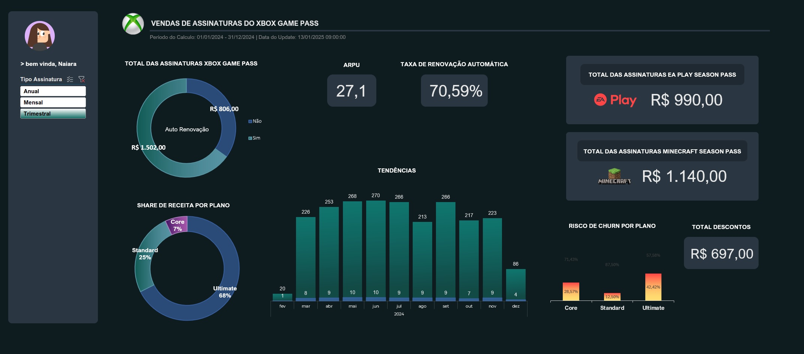

# Santander-2025_Dashboard_Excel
Desafio de criar um dashboard de vendas, com foco na organização e visualização de dados. O objetivo é transformar dados brutos em informações visuais claras e úteis, permitindo uma análise eficaz do desempenho de vendas e a tomada de decisões baseadas em dados.

# Dashboard de Análise de Assinaturas Xbox



## Sobre o Projeto

Este projeto consiste em um **Dashboard Analítico desenvolvido em Excel** para monitoramento de performance de vendas e retenção de assinaturas do serviço Xbox (Game Pass). 

O objetivo principal foi transformar uma base de dados bruta em insights estratégicos, focando em KPIs financeiros, análise de churn (risco de cancelamento) e tendências temporais.

## Principais Perguntas de Negócio Respondidas

- Qual é o **Faturamento Total** e o **Ticket Médio** das assinaturas?
- Qual é a taxa de **Retenção de Clientes** (Auto-Renovação)?
- Qual plano traz mais retorno financeiro (Share de Receita)?
- Existe sazonalidade nas vendas ao longo do ano?
- Qual é o risco de Churn por tipo de plano?

## Estrutura dos Dados

A base de dados (`Bases`) contém registros fictícios de assinantes com as seguintes colunas principais:

| Campo | Descrição |
| :--- | :--- |
| `Subscriber ID` | Identificador único do cliente |
| `Plano` | Tipo do plano (Core, Standard, Ultimate) |
| `Data Início` | Data de início da assinatura |
| `Auto Renovação` | Status de renovação automática (Yes/No) - Indicador de Churn |
| `Preço Assinatura` | Valor base da assinatura |
| `Tipo Assinatura` | Ciclo de pagamento (Mensal, Trimestral, Anual) |
| `Add-ons` | Assinaturas adicionais (EA Play, Minecraft Season Pass) |
| `Valor Total` | Valor final da transação (incluindo descontos e adicionais) |

## Ferramentas e Técnicas Utilizadas

- **Microsoft Excel**: Ferramenta principal.
- **Tabelas Dinâmicas (Pivot Tables)**: Para agregação e cálculo de métricas.
- **Gráficos Avançados**:
  - Gráfico de Rosca (Donut Chart) com formatação condicional para Share de Receita.
  - Gráfico de Barras Empilhadas Tendências Mensais.
  - Gráfico de Barras Empilhadas para Análise de Risco.
  - Cartões de KPIs personalizados.
- **Segmentação de Dados (Slicers)**: Para filtragem dinâmica e interativa.
- **Tratamento de Dados**: Limpeza de dados, ajuste de formatos de moeda e datas.

## Instruções para Reprodução

Para interagir com o dashboard ou editar o projeto:

1. **Clone este repositório**:
   ```bash
   git clone [https://github.com/seu-usuario/seu-repositorio.git](https://github.com/seu-usuario/seu-repositorio.git)
2. **Navegue até a Planilha "Dashboard"**
   Nela poderá interagir nos botões a esquerda de "Tipo de Assinatura" para analisar os 3 tipos; Anual, Mensal e Trimestral.
